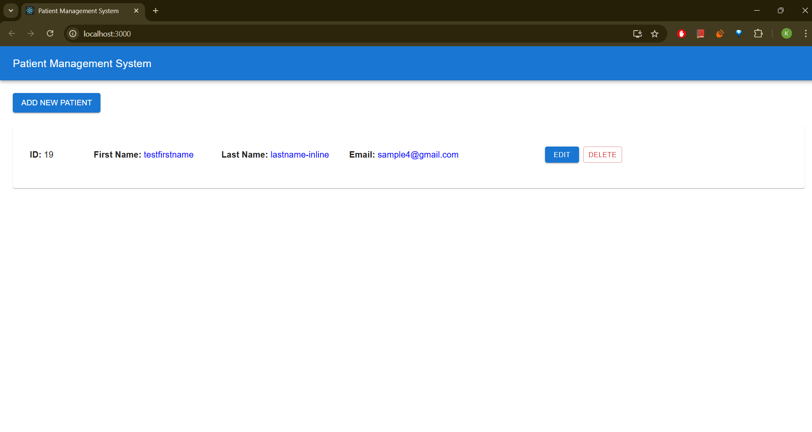

# Patient Management System

## Overview
The Patient Management System provides RESTful APIs to manage patient records. This includes creating, retrieving, updating, and deleting patient data. It ensures proper error handling and returns structured responses for seamless integration with frontend applications.

---

## API Contract

### 1. Create Patient
- **Endpoint**: `POST /patient/`
- **Description**: Creates a new patient record.
- **Request Body**:
    ```json
    {
      "first_name": "John",
      "last_name": "Doe",
      "address": "123 Main Street",
      "city": "Springfield",
      "state": "IL",
      "zip_code": "62704",
      "phone_number": "555-123-4567",
      "email": "john.doe@example.com"
    }
    ```
- **Response Body**:
    - **Success**:
      ```json
      {
        "code": "200",
        "errors": [],
        "data": [
          {
            "id": 1,
            "firstName": "John",
            "lastName": "Doe",
            "address": "123 Main Street",
            "city": "Springfield",
            "state": "IL",
            "zipCode": "62704",
            "phoneNumber": "555-123-4567",
            "email": "john.doe@example.com"
          }
        ]
      }
      ```
    - **Error (Duplicate Email)**:
      ```json
      {
        "code": "400",
        "errors": ["Error on Creating Patient", "Duplicate entry: The provided email is already in use."],
        "data": null
      }
      ```

---

### 2. Get Patient by ID
- **Endpoint**: `GET /patient/{id}`
- **Description**: Retrieves the patient record by its unique ID.
- **Path Parameters**:
  - `id` (Long): The ID of the patient to retrieve.
- **Response Body**:
    - **Success**:
      ```json
      {
        "code": "200",
        "errors": [],
        "data": [
          {
            "id": 1,
            "firstName": "John",
            "lastName": "Doe",
            "address": "123 Main Street",
            "city": "Springfield",
            "state": "IL",
            "zipCode": "62704",
            "phoneNumber": "555-123-4567",
            "email": "john.doe@example.com"
          }
        ]
      }
      ```
    - **Error (Not Found)**:
      ```json
      {
        "code": "404",
        "errors": ["Update Patient", "Error on Retrieving Patient"],
        "data": null
      }
      ```

---

### 3. Get All Patients
- **Endpoint**: `GET /patient/`
- **Description**: Retrieves all patient records.
- **Response Body**:
    - **Success**:
      ```json
      [
        {
          "code": "200",
          "errors": [],
          "data": [
            {
              "id": 1,
              "firstName": "John",
              "lastName": "Doe",
              "address": "123 Main Street",
              "city": "Springfield",
              "state": "IL",
              "zipCode": "62704",
              "phoneNumber": "555-123-4567",
              "email": "john.doe@example.com"
            },
            {
              "id": 2,
              "firstName": "Jane",
              "lastName": "Smith",
              "address": "456 Elm Street",
              "city": "Springfield",
              "state": "IL",
              "zipCode": "62704",
              "phoneNumber": "555-987-6543",
              "email": "jane.smith@example.com"
            }
          ]
        }
      ]
      ```
    - **Error**:
      ```json
      [
        {
          "code": "500",
          "errors": ["Retrieve Patients", "Error on Retrieving All Patients"],
          "data": null
        }
      ]
      ```

---


## Table Create Query
```
CREATE TABLE patient (
    id SERIAL PRIMARY KEY,               
    first_name VARCHAR(100) NOT NULL,
    last_name VARCHAR(100) NOT NULL,
    address TEXT NOT NULL,      
    city VARCHAR(100) NOT NULL, 
    state VARCHAR(100) NOT NULL,
    zip_code VARCHAR(20) NOT NULL,
    phone_number VARCHAR(15) NOT NULL,
    email VARCHAR(255) NOT NULL UNIQUE
);
```


## How to Run

### Backend
1. Clone the repository:
    ```
    git clone <repository-url>
    ```
2. Navigate to the project directory:
    ```
    cd patient-management-system
    ```
3. Build the project:
    ```
    ./gradlew build
    ```
4. Run the application:
    ```
    ./gradlew bootRun
    ```
5. Access the API at:
    ```
    http://localhost:8080/
    ```

---

### Frontend

#### Prerequisites
- Install [Node.js](https://nodejs.org/).

#### Steps
1. Clone the frontend repository:
    ```
    git clone <frontend-repository-url>
    ```
2. Navigate to the frontend directory:
    ```
    cd patient-management-frontend
    ```
3. Install dependencies:
    ```
    npm install
    ```
4. Start the development server:
    ```
    npm start
    ```
5. Access the frontend at:
    ```
    http://localhost:3000/
    ```

---

## Screenshots

### Add New Patients


### Added Records


### Dashboard


### Delete Patient


### Email Validation


### Inline Editing


### Patient Added


### Patient Deleted


### Patient Update Section


### Phone Validation


---
